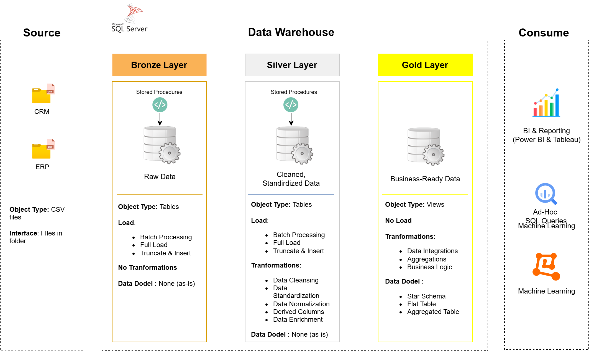

# Data Warehouse and Analytics Project Overview

This project demonstrates the development of a data warehousing and analytics solution, encompassing data warehouse construction and the generation of actionable insights. It serves as a portfolio piece showcasing industry best practices in data engineering and analytics.

---
## 🏗️ Data Architecture

The data architecture is structured using the Medallion Architecture, comprising Bronze, Silver, and Gold layers.


1.  **Bronze Layer**: This layer stores raw data from source systems in its native format. Data is ingested from CSV files into a SQL Server database.
2.  **Silver Layer**: This layer performs data cleansing, standardization, and normalization to prepare data for analytical processing.
3.  **Gold Layer**: This layer contains business-ready data, modeled using a star schema for reporting and analytics.

---
## 📖 Project Scope

This project involves the following key activities:

1.  **Data Architecture Design**: Implementation of a data warehouse architecture using the Medallion Architecture.
2.  **ETL Pipeline Development**: Construction of ETL pipelines to move data from source systems to the data warehouse.
3.  **Data Modeling**: Design and implementation of fact and dimension tables optimized for analytical queries.
4.  **Analytics and Reporting**: Development of SQL-based reports to provide actionable business insights.

🎯 This repository serves as a resource for demonstrating proficiency in:
-   SQL Development
-   Data Architecture
-   Data Engineering
-   ETL Pipeline Development
-   Data Modeling
-   Data Analytics

---

## 🛠️ Tools and Resources

The following tools and resources are used in this project:
-   **[Datasets](datasets/):** Project datasets (CSV files).
-   **[SQL Server Express](https://www.microsoft.com/en-us/sql-server/sql-server-downloads):** SQL Server database instance.
-   **[SQL Server Management Studio (SSMS)](https://learn.microsoft.com/en-us/sql/ssms/download-sql-server-management-studio-ssms?view=sql-server-ver16):** Database management tool.
-   **[Git Repository](https://github.com/):** Version control and collaboration platform.
-   **[DrawIO](https://www.drawio.com/):** Diagramming tool.
-   **[Notion](https://www.notion.com/):** Project management and documentation tool.
-   **[Notion Project Steps](https://www.notion.so/Data-Warehouse-Project-1a58780af51280ec95e1e329250eaa1c):** Project phase and task documentation.

---

## 🚀 Project Objectives

### Data Warehouse Development (Data Engineering)

#### Objective
To develop a data warehouse using SQL Server to support analytical reporting.

#### Specifications
-   **Data Sources**: Data ingestion from ERP and CRM systems (CSV files).
-   **Data Quality**: Implementation of data cleansing processes.
-   **Data Integration**: Integration of data from multiple sources.
-   **Scope**: Focus on current dataset.
-   **Documentation**: Provision of data model documentation.

---

### BI: Analytics & Reporting (Data Analysis)

#### Objective
To develop SQL-based analytics to provide insights into:
-   Customer behavior
-   Product performance
-   Sales trends

For further details, refer to [docs/requirements.md](docs/requirements.md).

## 📂 Repository Structure
```
data-warehouse-project/
│
├── datasets/                           # Raw datasets used for the project (ERP and CRM data)
│
├── docs/                               # Project documentation and architecture details
│   ├── etl.drawio                      # Draw.io file shows all different techniquies and methods of ETL
│   ├── data_architecture.drawio        # Draw.io file shows the project's architecture
│   ├── data_catalog.md                 # Catalog of datasets, including field descriptions and metadata
│   ├── data_flow.drawio                # Draw.io file for the data flow diagram
│   ├── data_models.drawio              # Draw.io file for data models (star schema)
│   ├── naming-conventions.md           # Consistent naming guidelines for tables, columns, and files
│
├── scripts/                            # SQL scripts for ETL and transformations
│   ├── bronze/                         # Scripts for extracting and loading raw data
│   ├── silver/                         # Scripts for cleaning and transforming data
│   ├── gold/                           # Scripts for creating analytical models
│
├── tests/                              # Test scripts and quality files
│
├── README.md                           # Project overview and instructions
├── LICENSE                             # License information for the repository
├── .gitignore                          # Files and directories to be ignored by Git
└── requirements.txt                    # Dependencies and requirements for the project
```
---
## 🛡️ License

This project uses the [MIT License](LICENSE). You can use, change, and share it.
